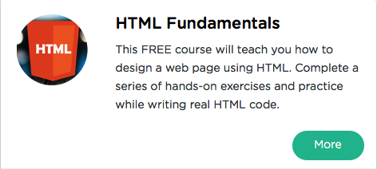

```
Roberto Nogueira  
BSd EE, MSd CE
Solution Integrator Experienced - Certified by Ericsson
```
# Sololearn Html



**About This Tutorial**

HTML tutorial is comprised of carefully selected videos, quizzes, and checkpoints to ensure that you learn as much as possible, while also having as much fun as possible. This is accomplished through a series of entertaining exercises, along with plenty of hands-on practice in writing actual HTML code.

[Sololearn Html](https://www.sololearn.com/Course/HTML/)

#### Topics
```
Html Fundamentals
[x] Overview
[x] Html Basics
[x] Challenges
[ ] Html5
[ ] Certificate
```
